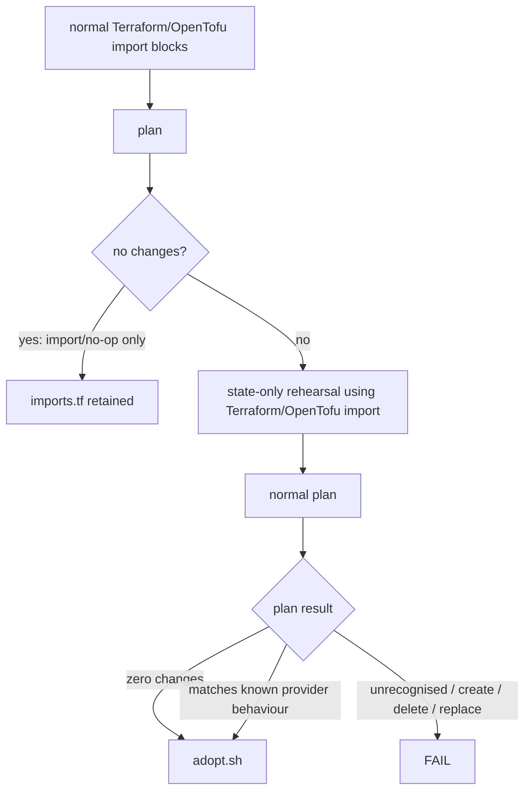

# Adoption safety

Heckle prefers normal declarative Terraform/OpenTofu `import` blocks. It rehearses the
finished project before publishing it and classifies the resulting plan before
asking the operator to make any decision about applying changes.



Plain-text version:

```text
normal Terraform/OpenTofu import blocks
          |
          v
       plan
          |
      no changes?
       /      \
     yes       no
      |         |
      v         v
 imports.tf   state-only rehearsal
 retained     using Terraform/OpenTofu import
                   |
                   v
              normal plan
                   |
               plan result
             /      |       \
          no-op    known     unrecognised
                  provider       change
                 behaviour         |
             \      /              v
              adopt.sh            FAIL
```

## Known provider behaviour

Some provider versions do not represent every remote setting cleanly during
import or refresh. Heckle records narrowly-defined, version-scoped cases where a
plan difference is expected under explicit guard conditions.

For example, `svalabs/forgejo` 1.6.0 can produce merge-setting differences when
`has_pull_requests = false`. Heckle can recognise those specific subordinate
attributes only while the controlling feature remains disabled before and after
the proposed update. A change to `has_pull_requests`, repository visibility,
permissions, description, or any unrecognised field does not match that rule.

Recognition is **not** a safety verdict. It means only that the difference matches
behaviour Heckle has recorded for that exact provider version. The differences
may be safe to reconcile because the affected settings are not currently active,
but Heckle cannot determine whether applying them is appropriate for a particular
environment. That decision belongs to the operator.

Heckle uses state-only `terraform import` / `tofu import` for this fallback so the adoption itself does
not write provider defaults back to the forge. The generated one-time `adopt.sh`
repeats the same check against `tofu show -json`; it accepts only the exact
address/attribute set rehearsed by Heckle and re-checks the controlling-feature
guards. The helper uses the already-available `python3` interpreter only to parse
that JSON; it does not import Heckle and it never runs `tofu apply`.

If the follow-up plan contains only recognised provider behaviour, `adopt.sh`
explains what Heckle recognised and leaves the apply decision to you. Review the
plan and the provider's behaviour carefully. If you choose to reconcile the
differences, apply the saved plan yourself and run another `tofu plan` afterwards.

If the plan contains any change outside Heckle's recorded compatibility rules,
`adopt.sh` stops and reports the unexpected address/action/attribute names. No plan
is applied automatically.

## Operator responsibility

Heckle assists with discovery and generation. Provider behaviour, forge APIs,
defaults, import semantics and upstream bugs can still produce unintended changes.
Heckle cannot guarantee that a generated or reconciled plan is safe, complete, or
appropriate for your environment.

Always review Terraform/OpenTofu plans before applying them. The decision to apply a plan,
and responsibility for the resulting changes to remote systems, remains with the
operator.
